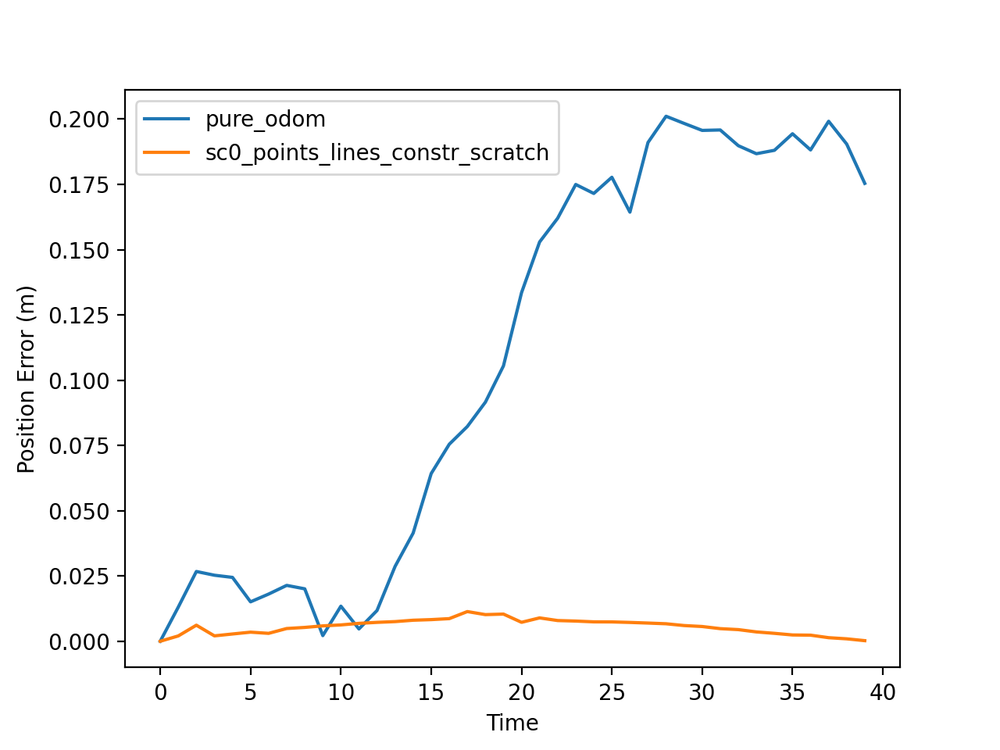
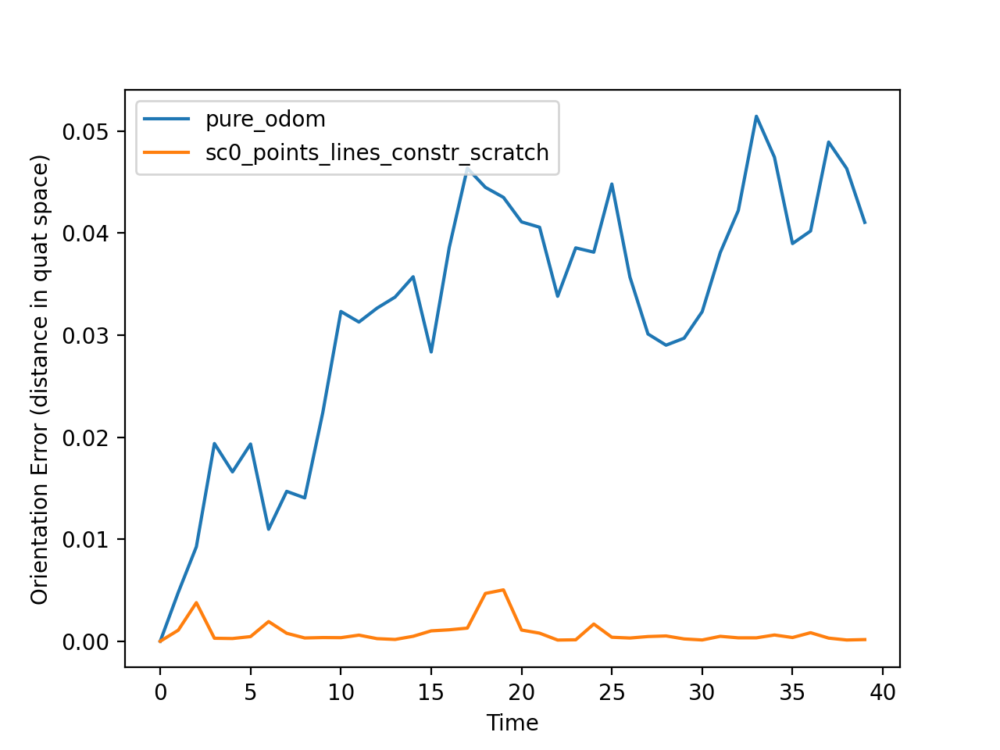
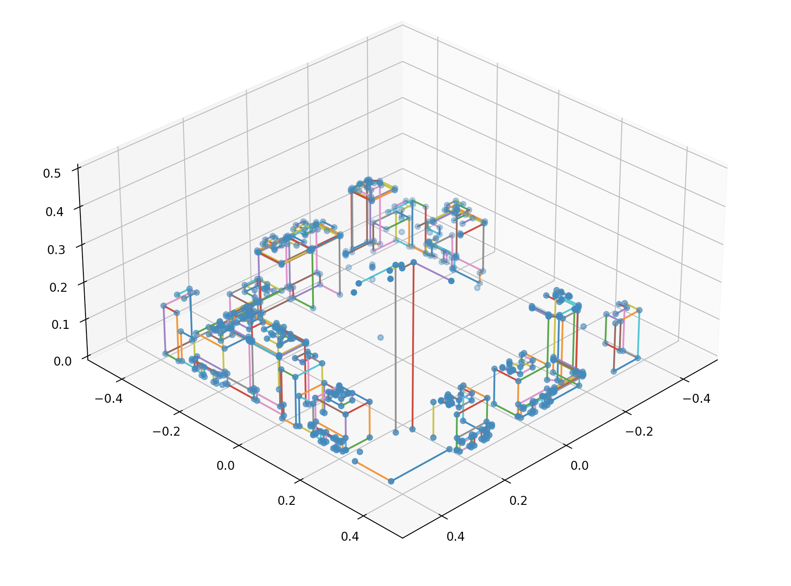

# WireSLAM

For context, read the paper `EE290_WireSLAM_Paper.pdf`. This repository implements the necessary components for the WireSLAM backend. This repository depends on `GTSAM`, `Eigen`, `Boost` and `TBB` (Intel Thread Building Blocks, which should already be installed). Synthetic wireframe data is present in the `wireframe` directory. `main_line.cc` implements a demo that runs the backend on sequence 0 from the synthetic data, with randomly generated odometry noise. To compile the demo, first create a build directory in the root of this repository:

```
mkdir build
cd build
```
Then compile
```
cmake ..
make
```
This will compile `main_line.cc` into an executable `wireslam-demo` and place it in `build`. To run, 
```
./wireslam-demo
```

The last few lines (the lines after the main loop) of the `main` method of `main_line.cc` specify filenames into which the results will be stored. By default, we store (1) poses generated by pure odometry integration, (2) ground-truth poses from the data, and (3) estimated poses from the backend. Finally, we also store the estimated structure (locations of points and lines). By default, the trajectories are stored in files

```
"results/pure_odom.csv"
"wireframe/seq0/gt_poses.csv"
"results/sc0_points_lines_constr_scratch.csv";
```
respectively, and structure is stored in
```
"results/struct_points_lines_constr_scratch.json"
```
You can change where these get saved by editing the corresponding lines in `main_line.cc` and re-compiling.

To compare the estimatesd trajectories with the ground-truth, use the script `src/vis.py`. This script takes as its first argument the location of the ground-truth csv, followed by any number of other trajectory csv files. For instance, to compare the errors for the default estimated trajectory and pure odometry trajectory, you can run
```
cd src
python vis.py ../wireframe/seq0/gt_poses.csv ../results/pure_odom.csv ../results/sc0_points_lines_constr_scratch.csv
```
This will generate two plots, one for translational error and one for rotational error as compared to ground-truth. These should look something like this:

<p align="middle">
    
	
</p>

If you specify more than one non-ground-truth CSV, they will all be displayed in the same plot as above. Finally, to visualize the estimated structure of the scene, pass a single structure CSV filename to the script `src/vis_structure.py`.

```
python vis_structure.py ../results/struct_points_lines_constr_scratch.json
```
This will bring up an interactive 3D plot, which should look like this.

<p align="middle">
    
</p>


